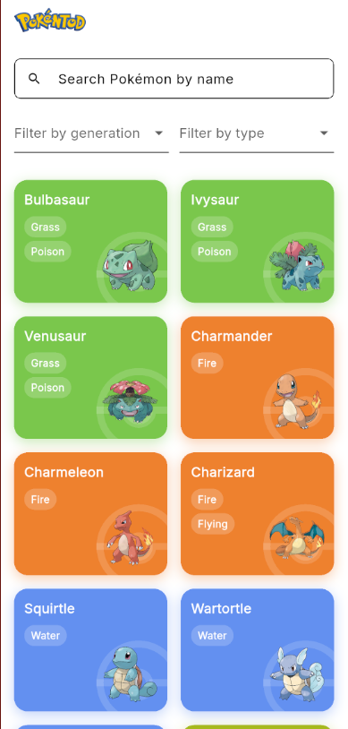
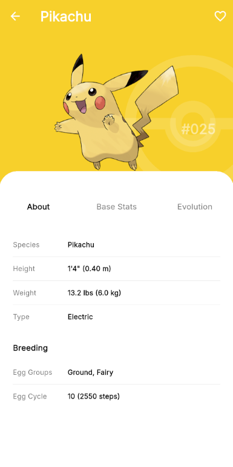
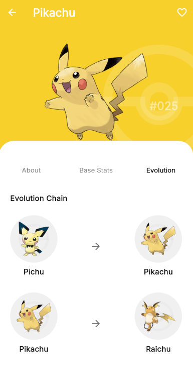

# Poketter

Poketter is a Pokedex app built with Flutter and Morpheme Lite. The app uses
data from [PokeAPI](https://pokeapi.co/) and follows a feature-driven Clean
Architecture structure.

## Screenshots

<p align="center">
  
  
  
</p>

## Features

- Browse Pokemon list.
- Search Pokemon by name.
- Filter Pokemon by generation and type.
- View Pokemon detail information.
- View Pokemon stats and evolution chain.
- Type-based Pokemon card colors.
- Cached Pokemon artwork.

## Tech Stack

- Flutter
- Morpheme Lite
- BLoC/Cubit
- `morpheme_base`
- `morpheme_http`
- `morpheme_cached_network_image`
- `go_router`
- `get_it`
- `equatable`

## Run Project

Use Morpheme Lite:

```bash
morpheme_lite run -f dev
```

The `dev` flavor is configured in `morpheme.yaml` and uses:

```yaml
BASE_URL: https://pokeapi.co/api/v2
```

## Project Structure

```text
lib/
  main.dart                         App entry point
  locator.dart                      Root dependency injection setup

  core/                             Shared app layer
    assets/                         Generated asset path constants
    components/                     Reusable UI components
      atoms/                        Small UI building blocks
      molecules/                    Combined reusable components
      support/                      Layout and pagination helpers
    constants/                      Route names, sizes, radius values
    endpoints/                      PokeAPI endpoint builders
    extensions/                     BuildContext, String, DateTime, color helpers
    global_cubit/                   App-wide Cubit/state
    l10n/                           Generated localization files
    themes/                         App colors and theme data
    utils/                          Shared utility classes

  features/
    pokemon/
      locator.dart                  Pokemon feature DI registration

      pokemon_list/                 Pokemon list feature
        data/
          datasources/              Remote API calls for list/filter data
          models/                   Request/response DTOs
          repositories/             Repository implementations
        domain/
          entities/                 App-facing Pokemon list models
          repositories/             Repository contracts
          usecases/                 List/filter business actions
        presentation/
          bloc/                     Pokemon list BLoC
          cubit/                    List and filter Cubits
          pages/                    Pokemon list screen
          widgets/                  Pokemon grid, card, type badge

      pokemon_detail/               Pokemon detail feature
        data/
          datasources/              Remote API calls for detail/species/evolution
          models/                   Request/response DTOs
          repositories/             Repository implementations
        domain/
          entities/                 Detail, species, evolution entities
          repositories/             Repository contracts
          usecases/                 Detail/species/evolution actions
        presentation/
          bloc/                     Detail, species, evolution BLoCs
          cubit/                    Detail page Cubit/state
          pages/                    Pokemon detail screen
          widgets/                  About, stats, evolution tabs

  routes/
    routes.dart                     GoRouter root config
    features/                       Feature route definitions
    helper/                         Route helper utilities

assets/
  images/                           Logo, Pokeball, screenshots
  illustrations/                    Empty/placeholder illustrations
  l10n/                             Source ARB localization files

test/
  features/pokemon/                 Unit tests by feature and layer
```

## Data Source

Pokemon data is provided by [PokeAPI](https://pokeapi.co/).

Pokemon and Pokemon character names are trademarks of Nintendo.
